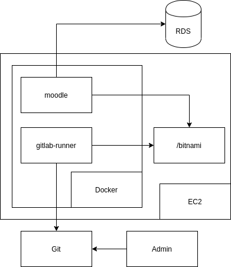
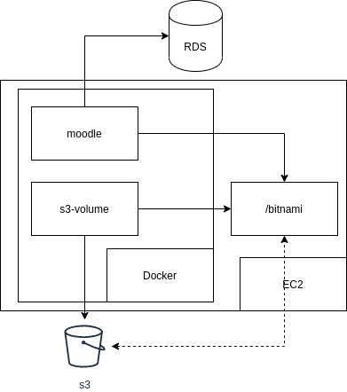
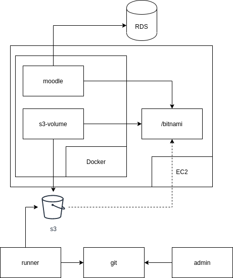
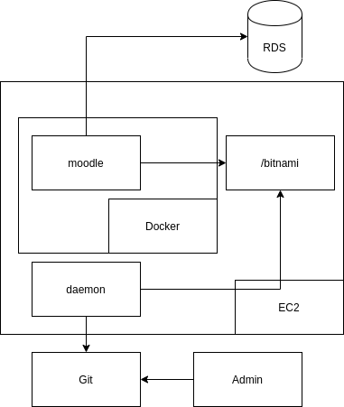

# cicd-proyecto1

Repositorio para la sincronización de las instancias de Moodle. Aquí probamos varias formas de sincronizar las instancias.

El archivo [docker-compose.yml](docker-compose.yml) en el root del repositorio se encarga de hacer el siguiente despliegue:

En la carpeta "withs3" se monta la siguiente arquitectura:

Este despliegue fue implementado en el repositorio nuestro de Moodle: https://gitlab.com/anietog1/moodle_data

El archivo conf.sh hace un despliegue con la siguiente arquitectura:

Finalmente, lo que tenemos en producción es la segunda arquitectura debido a que hacer el mantenimiento del runner con el asunto de las credenciales es un proceso altamente tedioso.
